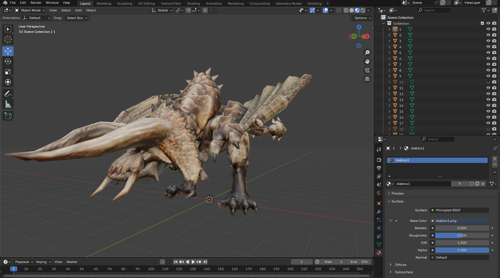

  

<h1 align="center">
  Monster Hunter Freedom Unite Database
</h1>

Welcome to this dedicated repo for a 16 years-old game! If you have played the MH series before, 
I shall remind you that this is not about MHGU, MHW, MHR, or MH Wild... It's MHFU! 
(or MHP2G in Japan) 

<h3 align="center">
Current valid number of lines in DB: 207705
</h3>

### 🗿 BIG NEWS: model update coming!

  

Recently I have made some luck with extracting 3D models from the game and I have included a sample in the above picture. Although it requires a tremendous amount of effort to rip a model like above, I am interested in doing this in my free time. (Maybe that will make my DB the only place on the internet to find MHFU models? LOL) **That being said, if you want to upload them to places like [The Spriters Resource](https://www.spriters-resource.com/browse/), please ASK ME. It takes A LOT works to rip the models.** For other use cases like use them in your software, I'm completely OK with it.

Another note, I'm going to rename Image DB to Asset DB and all ripped models will be stored there, along with the images. 

💖 If you love mhfu-db, please consider give it a ⭐! Your support will make me happy. 🤗

### 🖼️ Image DB
Good news! Recently I have been working on the image database for MHFU. If you want to check it out [click here](https://github.com/Kolyn090/mhfu-image-db.git).

### ❓What is this
This is a database repo for game Monster Hunter Freedom Unite by CAPCOM. My current plan is to 
store data in JSON format. I try to make sure that the data are organized in a way that it is 
easy to read and understand (at least by someone who has played the game before). Each JSON file
will store an array of objects, and each object has the *same* properties, so a JSON file is really 
a table. 

### 🔅Contributing
Feel free to send an issue if you spot any typo/mistake. Of course, you are free to fork this repo 
and contribute as well! ❗️Please note that your contribution must be from a crediable source and 
it's not violating any copyright.

### ❓Why am I creating a database for MHFU
First of all, I have played this particular MH version for a long time - probably the longest 
time I have spent on a game. It all started on the iOS version ($15 USD but definitely worth it).
I had continued to play this game at my leisure since then! Until the game was taken down from
App Store. It was sad to see it go! However, recently, with PPSSPP being introduced to iOS, I
was able to revive this game on my phone! It really brightened my mood and I decided to do something
I have been thinking for a long time - to create a DB for this game.

Secondly, it's hard to find accurate information about this game because it's old (and thus less
people care) and there isn't a complete decrypted game file available online (to my knowledge). 
Most information available online were manually gathered by the community, and data obtained in this 
way might contain errors if not done carefully. Thus we need someone willing to verify and maintain
all those data! That's why this repo will be for providing complete, accurate data about MHFU. 

### 🧶Attributions
To gather everything from scratch is extremely time-consuming. That's why I decided to borrow some
help from online communities. Yes, I know it is not perfect but I will manually verify them. Also,
I cite all sources I used in the 
[Attributions.txt](https://github.com/Kolyn090/mhfu-db/blob/main/Attributions.txt) file. Here, I
also want to say Thank you🤗 to those selfless authors for making them available!

